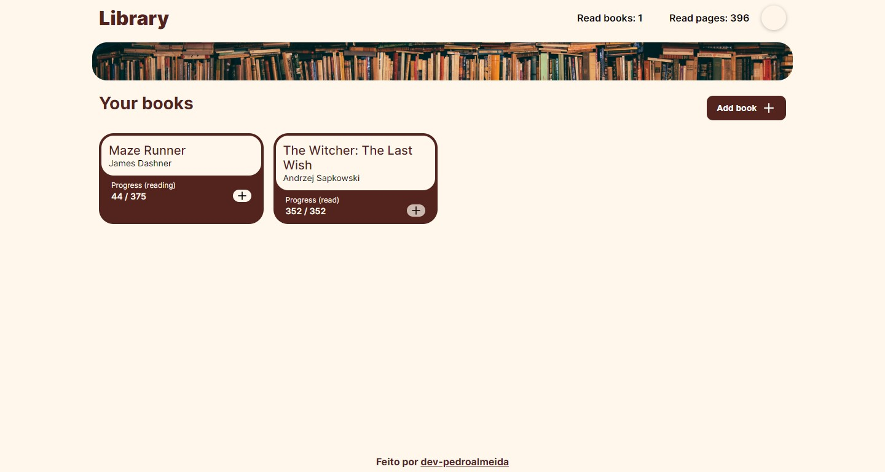

 

  <h3 align="center">Library app</h3>

  

    A library app made with HTML, CSS and Javascript
     
  

## About the project

  

 
This project allows users to add books they're reading or have read and keep track of it by incrementing the amount of pages they've read.

### Made with

* ![HTML][HTML.js]
* ![CSS.js][CSS.js]
* ![Javascript][Javascript]

<!-- MARKDOWN LINKS & IMAGES -->
<!-- https://www.markdownguide.org/basic-syntax/#reference-style-links -->

[HTML.js]: https://img.shields.io/badge/Html-20232A?style=for-the-badge&logo=html5

[CSS.js]: https://img.shields.io/badge/css-131417?style=for-the-badge&logo=css3&logoColor=249bf0

[Javascript]: https://img.shields.io/badge/Javascript-20232A?style=for-the-badge&logo=javascript